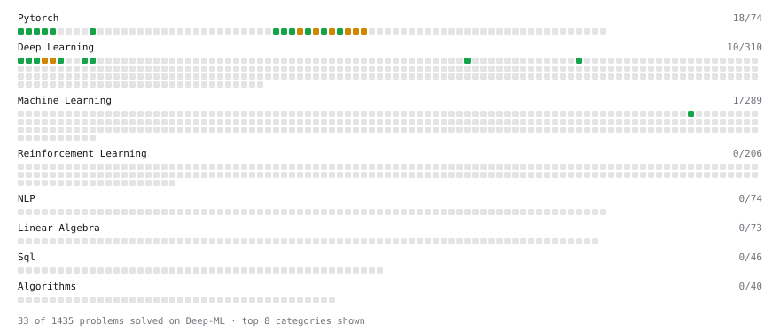

# Deep-ML

My machine learning practice from [Deep-ML](https://www.deep-ml.com). Every solution here was written by hand.

**29** solved · 24 problems · 2 labs · 3 math

[**Browse the interactive portfolio**](https://vasabi07.github.io/deep-ml/) to replay this filling in over time.

## Problems

| | Difficulty | Solved | |
| --- | --- | --- | --- |
| [Add a Bias Vector to a Batch via Broadcasting](https://www.deep-ml.com/problems/882) | easy | 2026-09-18 | [solution](problems/0882-add-a-bias-vector-to-a-batch-via-broadcasting) |
| [Backprop a Linear Layer by Hand](https://www.deep-ml.com/problems/898) | easy | 2026-09-21 | [solution](problems/0898-backprop-a-linear-layer-by-hand) |
| [Compute a Gradient with PyTorch Autograd](https://www.deep-ml.com/problems/884) | easy | 2026-09-18 | [solution](problems/0884-compute-a-gradient-with-pytorch-autograd) |
| [Create a Float Tensor from a Python List](https://www.deep-ml.com/problems/880) | easy | 2026-09-18 | [solution](problems/0880-create-a-float-tensor-from-a-python-list) |
| [Create and Inspect a Tensor](https://www.deep-ml.com/problems/1220) | easy | 2026-09-22 | [solution](problems/1220-create-and-inspect-a-tensor) |
| [Derivatives of Activation Functions](https://www.deep-ml.com/problems/217) | easy | 2026-09-18 | [solution](problems/0217-derivatives-of-activation-functions) |
| [Gradient of a Square with Autograd](https://www.deep-ml.com/problems/1222) | easy | 2026-09-22 | [solution](problems/1222-gradient-of-a-square-with-autograd) |
| [Implement a Linear Layer Forward Pass with Matrix Multiplication](https://www.deep-ml.com/problems/883) | easy | 2026-09-18 | [solution](problems/0883-implement-a-linear-layer-forward-pass-with-matrix-multiplication) |
| [Implement ReLU Activation Function](https://www.deep-ml.com/problems/42) | easy | 2026-09-18 | [solution](problems/0042-implement-relu-activation-function) |
| [Implement ReLU and Leaky ReLU](https://www.deep-ml.com/problems/1226) | easy | 2026-09-19 | [solution](problems/1226-implement-relu-and-leaky-relu) |
| [Implementation of Log Softmax Function](https://www.deep-ml.com/problems/39) | easy | 2026-09-18 | [solution](problems/0039-implementation-of-log-softmax-function) |
| [Leaky ReLU Activation Function](https://www.deep-ml.com/problems/44) | easy | 2026-09-18 | [solution](problems/0044-leaky-relu-activation-function) |
| [Mean Squared Error from Scratch](https://www.deep-ml.com/problems/1228) | easy | 2026-09-19 | [solution](problems/1228-mean-squared-error-from-scratch) |
| [Reshape and Transpose a Tensor](https://www.deep-ml.com/problems/881) | easy | 2026-09-18 | [solution](problems/0881-reshape-and-transpose-a-tensor) |
| [Reshape and Transpose a Tensor](https://www.deep-ml.com/problems/1221) | easy | 2026-09-22 | [solution](problems/1221-reshape-and-transpose-a-tensor) |
| [Sigmoid Activation Function Understanding](https://www.deep-ml.com/problems/22) | easy | 2026-09-18 | [solution](problems/0022-sigmoid-activation-function-understanding) |
| [Single Linear Neuron Forward](https://www.deep-ml.com/problems/1224) | easy | 2026-09-18 | [solution](problems/1224-single-linear-neuron-forward) |
| [Softmax Activation Function Implementation ](https://www.deep-ml.com/problems/23) | easy | 2026-09-18 | [solution](problems/0023-softmax-activation-function-implementation) |
| [Derivative of Cross-Entropy Loss w.r.t. Logits](https://www.deep-ml.com/problems/220) | medium | 2026-09-21 | [solution](problems/0220-derivative-of-cross-entropy-loss-w-r-t-logits) |
| [Gradient of a Weighted Sum of Squares](https://www.deep-ml.com/problems/1223) | medium | 2026-09-22 | [solution](problems/1223-gradient-of-a-weighted-sum-of-squares) |
| [Implementing Basic Autograd Operations](https://www.deep-ml.com/problems/26) | medium | 2026-09-21 | [solution](problems/0026-implementing-basic-autograd-operations) |
| [Numerically Stable Softmax](https://www.deep-ml.com/problems/1227) | medium | 2026-09-19 | [solution](problems/1227-numerically-stable-softmax) |
| [Single Neuron with Backpropagation](https://www.deep-ml.com/problems/25) | medium | 2026-09-19 | [solution](problems/0025-single-neuron-with-backpropagation) |
| [Two-Layer MLP Forward Pass](https://www.deep-ml.com/problems/1225) | medium | 2026-09-19 | [solution](problems/1225-two-layer-mlp-forward-pass) |

## Labs

| | Difficulty | Solved | |
| --- | --- | --- | --- |
| [Design Your Own Activation Function](https://www.deep-ml.com/labs/9) | easy | 2026-09-18 | [solution](labs/0009-design-your-own-activation-function) |
| [Fit Linear Regression with Autograd](https://www.deep-ml.com/labs/9ff596ea-672e-4101-9ce4-0856c55b62c9) | medium | 2026-09-22 | [solution](labs/9ff596ea-672e-4101-9ce4-0856c55b62c9-fit-linear-regression-with-autograd) |

## Math

| | Difficulty | Solved | |
| --- | --- | --- | --- |
| [Backpropagation and the Chain Rule](https://www.deep-ml.com/math-problems/4) | medium | 2026-09-19 | [solution](math/0004-backpropagation-and-the-chain-rule) |
| [Matrix Calculus Identities](https://www.deep-ml.com/math-problems/35) | medium | 2026-09-19 | [solution](math/0035-matrix-calculus-identities) |
| [Neural Network Derivatives](https://www.deep-ml.com/math-problems/3) | medium | 2026-09-19 | [solution](math/0003-neural-network-derivatives) |

---

_This file is regenerated by Deep-ML on every push._
